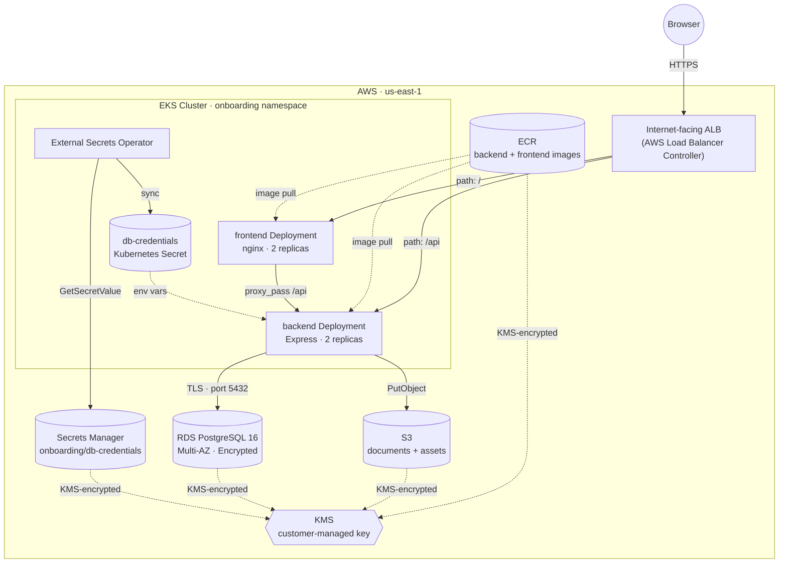
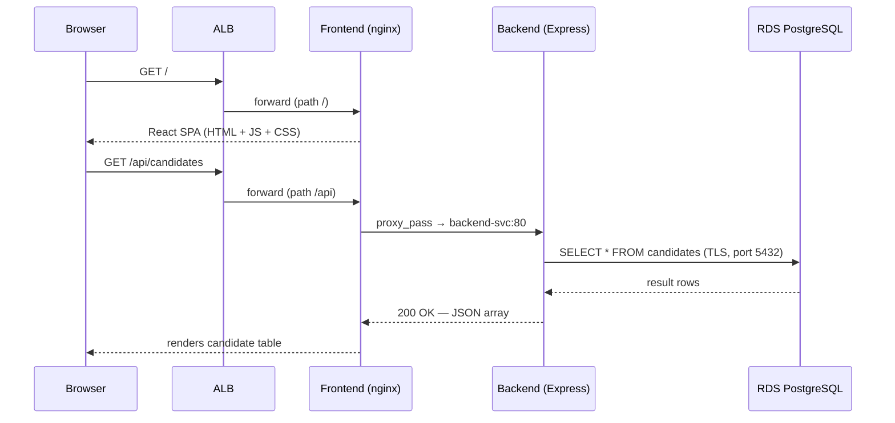
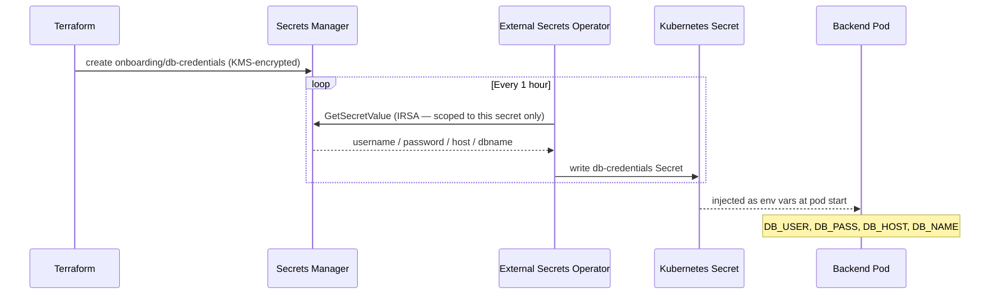
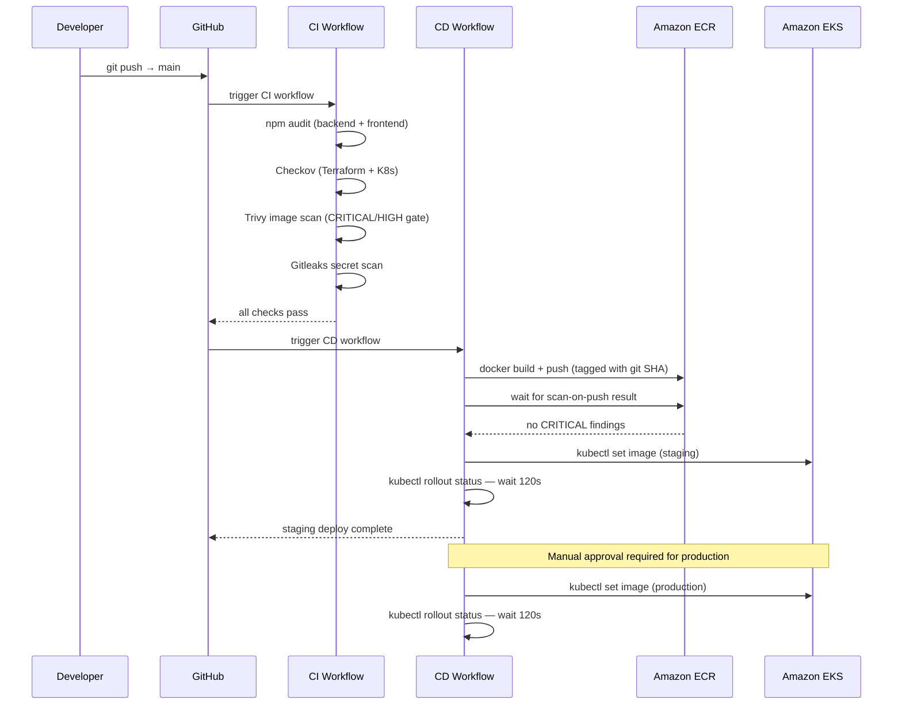
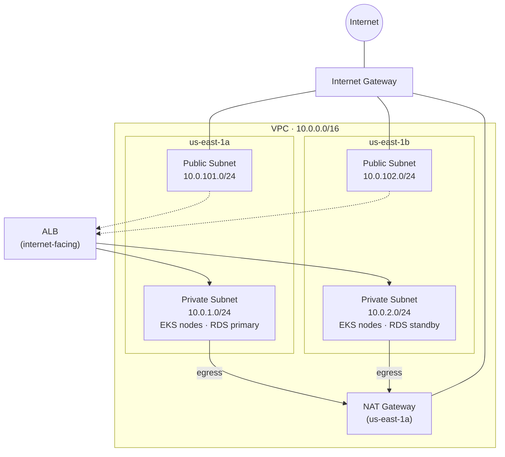
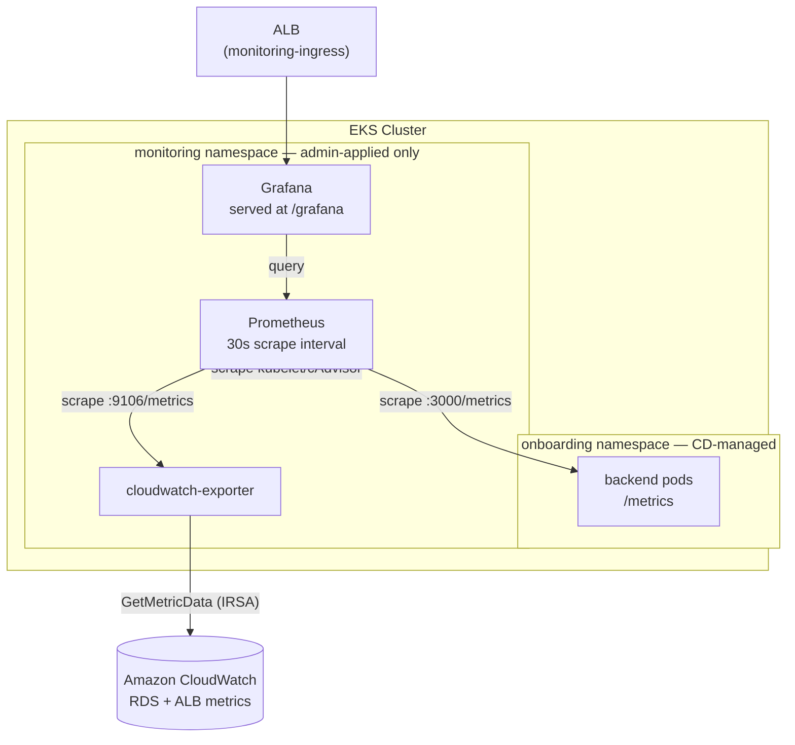
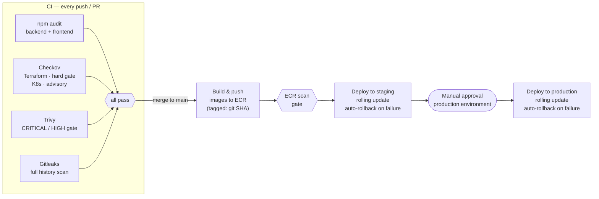

# Employee Onboarding Platform

> A cloud-native, three-tier employee onboarding and candidate screening system built on Amazon EKS, deployed through a fully automated, security-gated CI/CD pipeline.

| | |
|---|---|
| **Frontend** | React 18 + Vite, served by nginx |
| **Backend** | Node.js + Express REST API |
| **Database** | Amazon RDS PostgreSQL 16 — Multi-AZ, encrypted |
| **Runtime** | Amazon EKS 1.31 — `us-east-1` |
| **Infrastructure** | Terraform (`terraform-aws-modules`) |
| **CI/CD** | GitHub Actions — OIDC-authenticated, no stored keys |
| **Secrets** | AWS Secrets Manager + External Secrets Operator |
| **Registry** | Amazon ECR — immutable tags, scan-on-push |
| **Observability** | Prometheus + Grafana + CloudWatch exporter — admin-bootstrapped, outside CI/CD's reach |

---

## Table of Contents

- [Architecture](#architecture)
- [Application Design](#application-design)
- [Data Flow](#data-flow)
- [Networking](#networking)
- [Security](#security)
- [Observability](#observability)
- [CI/CD Pipeline](#cicd-pipeline)
- [Repository Structure](#repository-structure)
- [Deployment](#deployment)
- [Known Gaps](#known-gaps)

---

## Architecture

The platform follows a strict three-tier architecture. The browser never communicates directly with the backend — all traffic enters through a single internet-facing ALB, which routes to the frontend. The frontend proxies API calls to the backend, and only the backend holds a database connection.



| Component | File | Responsibility |
|---|---|---|
| **ALB Ingress** | `k8s/ingress.yaml` | Single internet-facing entry point; path-based routing to frontend and backend Services |
| **Frontend** | `frontend/` | React SPA compiled by Vite, served by nginx; proxies `/api/*` to backend — browser never calls backend directly |
| **Backend** | `backend/` | Stateless Express REST API; sole component with a database connection |
| **RDS PostgreSQL** | `terraform/main.tf` | System of record — `candidates` and `employees` tables; Multi-AZ, encrypted at rest |
| **External Secrets Operator** | `k8s/external-secrets.yaml` | Syncs DB credentials from Secrets Manager into a Kubernetes Secret every hour |
| **ECR** | `terraform/main.tf` | Immutable, KMS-encrypted image registry with scan-on-push for both services |
| **S3** | `terraform/main.tf` | Document and asset storage; versioned, KMS-encrypted, no public access |
| **KMS** | `terraform/security.tf` | Single customer-managed key with auto-rotation encrypting all data stores |

---

## Application Design

### Frontend — `frontend/`

- React 18 SPA built with Vite; two views — **Candidates** (hiring and screening) and **Employees** (onboarding tracking)
- All API calls use relative `/api/*` paths — the browser never holds a backend address
- Served by nginx on port 80; `nginx.conf` handles SPA fallback routing (`try_files $uri /index.html`) and reverse-proxies `/api` to `backend-svc.onboarding.svc.cluster.local`
- **Container:** multi-stage build — `node:20-alpine` compiles the Vite bundle, `nginx:1.27-alpine` serves it; runs as non-root, read-only root filesystem, all Linux capabilities dropped

### Backend — `backend/`

- Express REST API on port 3000; stateless — any replica can serve any request
- **Routes:**

| Method | Path | Description |
|---|---|---|
| `GET` | `/api/candidates` | List all candidates, newest first |
| `POST` | `/api/candidates` | Add a new candidate |
| `PATCH` | `/api/candidates/:id/status` | Update candidate status (`pending` / `approved` / `rejected`) |
| `GET` | `/api/employees` | List all onboarded employees |
| `POST` | `/api/employees` | Add a new employee |

- Connects to PostgreSQL via `pg.Pool`; creates its own tables on boot (`CREATE TABLE IF NOT EXISTS`) — no separate migration step
- DB credentials injected as environment variables from the Kubernetes Secret managed by External Secrets Operator
- **Container:** multi-stage build — `node:20-alpine` installs production dependencies, `gcr.io/distroless/nodejs20-debian12` runs the app — no shell, no package manager, minimal attack surface

### Database — Amazon RDS PostgreSQL 16

- `db.t3.micro`, Multi-AZ standby in `us-east-1b`, private subnets only
- Storage encrypted with the project KMS key; IAM database authentication enabled; deletion protection on
- Custom parameter group: `log_statement = all`, `log_min_duration_statement = 1000ms`
- Enhanced monitoring (60s interval) and Performance Insights enabled, both KMS-encrypted
- Automated minor version upgrades enabled; tags copied to all snapshots

---

## Data Flow

### Page Load and API Call — End to End



### Secrets Flow — No Human Ever Holds the Password



### CI/CD Deployment Flow



---

## Networking



EKS worker nodes and the RDS instance live exclusively in the private subnets. There is no direct inbound route from the internet to any compute resource — the ALB is the sole ingress point, forwarding directly to pod IPs (`target-type: ip`).

### Security Groups

| Security Group | Inbound | Outbound |
|---|---|---|
| **RDS SG** | TCP 5432 from `10.0.0.0/16` (VPC only) | TCP 443 to `0.0.0.0/0` (AWS API calls) |
| **EKS Node SG** | Webhook ports (443, 4443, 6443, 8443, 9443, 10250) from cluster SG; DNS (53) and ephemeral ports (1025–65535) self-referencing | Default allow-all |

### Kubernetes NetworkPolicies — `k8s/network-policy.yaml`

| Policy | Selector | Effect |
|---|---|---|
| `backend-allow-frontend` | `app: backend` | Accepts ingress **only** from pods labeled `app: frontend` on port 3000 |
| `frontend-allow-ingress` | `app: frontend` | Accepts ingress only from `kube-system` namespace on port 80 |
| `backend-egress` | `app: backend` | Egress restricted to port 5432 (RDS), 443 (AWS APIs), 53/UDP (DNS) |

### ALB Ingress Routing — `k8s/ingress.yaml`

| Path | Service | Target Port |
|---|---|---|
| `/api` | `backend-svc:80` | backend pods `:3000` |
| `/` | `frontend-svc:80` | frontend pods `:80` |

```bash
# Get the live ALB address
kubectl get ingress onboarding-ingress -n onboarding
```

---

## Security

Security is applied at every layer of the stack — from the developer's workstation to the running pod.

| Layer | Control |
|---|---|
| **AWS Credentials** | GitHub Actions authenticates via OIDC federation — no long-lived access keys stored anywhere |
| **IAM** | Least-privilege per workload: `github-actions-role` (ECR push + EKS describe), `external-secrets-role` (read one secret via IRSA), `rds-monitoring-role` (enhanced monitoring only) |
| **Secrets** | Never touch the pipeline or the image; synced directly from Secrets Manager into a Kubernetes Secret by External Secrets Operator every hour |
| **Container Runtime** | Both images run as non-root; backend uses distroless (no shell, no package manager); frontend uses nginx as UID 101; read-only root filesystem; all Linux capabilities dropped |
| **Network** | Default-deny Kubernetes NetworkPolicies scoped per tier; RDS accessible only from within the VPC |
| **Data at Rest** | RDS, S3, ECR, and Secrets Manager all encrypted with a single customer-managed KMS key (auto-rotation enabled) |
| **Data in Transit** | RDS enforces TLS-only connections via parameter group (`rds.force_ssl = 1`) |
| **Image Integrity** | ECR repositories use immutable tags — pushed images cannot be overwritten; scan-on-push enabled |
| **Availability** | RDS Multi-AZ standby; PodDisruptionBudgets (`minAvailable: 1`) on both Deployments; EKS node group spans two AZs |
| **CI Security Gates** | `npm audit`, Checkov (IaC), Trivy (container images), Gitleaks (secrets in git history) — any failure blocks the pipeline |

---

## Observability

Metrics live in a separate `monitoring` namespace, applied directly by a cluster admin rather than by CI/CD. This is a deliberate boundary, not an oversight: `github-actions-role` is scoped by EKS access entry to the `onboarding` namespace only (`terraform/main.tf`), and cannot reach `monitoring` or any cluster-scoped resource — the same reason `k8s/bootstrap/rbac.yaml` is kept out of the CD-applied path. The role that deploys the app must not be able to grant itself cluster-wide access.



| Component | Manifest | Responsibility |
|---|---|---|
| **Prometheus** | `k8s/monitoring/prometheus/` | Scrapes EKS node/pod metrics (kubelet, cAdvisor), the backend's `/metrics` endpoint, and the CloudWatch exporter — 30s interval |
| **cloudwatch-exporter** | `k8s/monitoring/cloudwatch-exporter/` | Bridges CloudWatch metrics (RDS, ALB) into Prometheus format via a scoped IRSA role (`cloudwatch:GetMetricData`/`ListMetrics` only) |
| **Grafana** | `k8s/monitoring/grafana/` | Dashboards at `/grafana`; Prometheus datasource and dashboards auto-provisioned from ConfigMaps; admin password sourced from `onboarding/grafana-admin` in Secrets Manager |
| **Ingress** | `k8s/monitoring/ingress.yaml` | Separate internet-facing ALB, path-scoped to `/grafana` |

Bootstrapping the stack (cluster-admin credentials, one time):

```bash
kubectl apply -f k8s/monitoring/namespace.yaml
bash k8s/monitoring/bootstrap-grafana-secret.sh   # pulls the admin password from Secrets Manager
kubectl apply -R -f k8s/monitoring/
```

---

## CI/CD Pipeline

Two independent GitHub Actions workflows. CI runs on every push and pull request. CD runs only on merge to `main` after CI passes, deploying first to staging then to production behind a manual approval gate.



### CI Gates

| Gate | Tool | Failure Behaviour |
|---|---|---|
| Dependency audit | `npm audit --audit-level=high` | Hard block |
| IaC scan | Checkov | Hard block (Terraform); advisory (K8s) |
| Image vulnerability scan | Trivy — CRITICAL/HIGH | Hard block |
| Secret detection | Gitleaks — full history | Hard block |

### CD Stages

| Stage | Environment | Trigger |
|---|---|---|
| Build & push | `staging` | Automatic on CI pass |
| ECR scan gate | — | Automatic — blocks on CRITICAL findings |
| Deploy to staging | `staging` | Automatic |
| Deploy to production | `production` | Manual approval required |

### GitHub Environments Setup

Create three environments in **Settings → Environments**: `ci`, `staging`, `production`.  
Enable **Required reviewers** on `production`.

Add the following variables to `staging` and `production`:

| Variable | Value |
|---|---|
| `AWS_REGION` | `us-east-1` |
| `AWS_ROLE_ARN` | `arn:aws:iam::246312965731:role/github-actions-role` |
| `EKS_CLUSTER` | `onboarding-cluster` |
| `ECR_BACKEND` | `246312965731.dkr.ecr.us-east-1.amazonaws.com/onboarding-backend` |
| `ECR_FRONTEND` | `246312965731.dkr.ecr.us-east-1.amazonaws.com/onboarding-frontend` |

Add to `ci`:

| Variable | Value |
|---|---|
| `NODE_VERSION` | `20` |

---

## Repository Structure

```
.
├── .github/
│   └── workflows/
│       ├── ci.yml              # Security gates — runs on every push and PR
│       └── cd.yml              # Build, push, deploy — runs on merge to main
│
├── backend/
│   ├── Dockerfile              # Multi-stage: node:20-alpine → distroless
│   ├── package.json
│   └── index.js                # Express API — candidates + employees routes
│
├── frontend/
│   ├── Dockerfile              # Multi-stage: node:20-alpine → nginx:1.27-alpine
│   ├── nginx.conf              # SPA fallback + /api proxy to backend-svc
│   ├── vite.config.js
│   ├── package.json
│   └── src/
│       ├── main.jsx            # React router entry point
│       └── pages/
│           ├── Candidates.jsx  # Hiring and screening view
│           └── Onboarding.jsx  # Employee onboarding view
│
├── k8s/
│   ├── external-secrets.yaml   # SecretStore + ExternalSecret (Secrets Manager → K8s)
│   ├── backend.yaml            # Deployment + Service
│   ├── frontend.yaml           # Deployment + Service
│   ├── ingress.yaml            # ALB Ingress — path-based routing
│   ├── network-policy.yaml     # Default-deny NetworkPolicies per tier
│   ├── pdb.yaml                # PodDisruptionBudgets (minAvailable: 1)
│   │
│   ├── bootstrap/
│   │   └── rbac.yaml           # Admin-applied only — CD must never grant itself RBAC
│   │
│   └── monitoring/              # Admin-applied only — outside CD's namespace scope
│       ├── namespace.yaml
│       ├── ingress.yaml         # Separate ALB, path-scoped to /grafana
│       ├── bootstrap-grafana-secret.sh
│       ├── prometheus/
│       ├── grafana/
│       └── cloudwatch-exporter/
│
├── terraform/
│   ├── main.tf                 # VPC, EKS, ECR, S3, RDS, Secrets Manager
│   ├── security.tf             # KMS, OIDC provider, IAM roles and policies
│   ├── monitoring.tf            # cloudwatch-exporter IRSA role, Grafana admin secret
│   ├── variables.tf
│   └── outputs.tf
│
└── .checkov.ini                # IaC scan suppressions with documented reasons
```

---

## Deployment

### Prerequisites

- AWS CLI v2
- Terraform >= 1.5
- kubectl
- Docker Desktop
- Helm 3

### 1 — Provision Infrastructure

```bash
cd terraform
terraform init
terraform apply -var="db_password=<YOUR_STRONG_PASSWORD>"
```

Note the outputs — you will need `eks_cluster_name`, `ecr_backend_url`, and `ecr_frontend_url`.

### 2 — Configure kubectl

```bash
aws eks update-kubeconfig --region us-east-1 --name onboarding-cluster
kubectl get nodes  # verify connectivity
```

### 3 — Install Cluster Add-ons

```bash
# AWS Load Balancer Controller
helm repo add eks https://aws.github.io/eks-charts && helm repo update
helm install aws-load-balancer-controller eks/aws-load-balancer-controller \
  -n kube-system \
  --set clusterName=onboarding-cluster \
  --set serviceAccount.create=true

# External Secrets Operator
helm repo add external-secrets https://charts.external-secrets.io && helm repo update
helm install external-secrets external-secrets/external-secrets \
  -n external-secrets --create-namespace
```

### 4 — Build and Push Docker Images

```bash
aws ecr get-login-password --region us-east-1 \
  | docker login --username AWS --password-stdin \
    246312965731.dkr.ecr.us-east-1.amazonaws.com

# Backend — tag with a commit SHA, not :latest
# (ECR repos use immutable tags; a floating :latest tag can never be
# overwritten once pushed, so CI/CD tags every build with git SHA only)
cd backend
SHA=$(git rev-parse HEAD)
docker build -t 246312965731.dkr.ecr.us-east-1.amazonaws.com/onboarding-backend:$SHA .
docker push 246312965731.dkr.ecr.us-east-1.amazonaws.com/onboarding-backend:$SHA

# Frontend
cd ../frontend
docker build -t 246312965731.dkr.ecr.us-east-1.amazonaws.com/onboarding-frontend:$SHA .
docker push 246312965731.dkr.ecr.us-east-1.amazonaws.com/onboarding-frontend:$SHA
```

### 5 — Deploy to Kubernetes

```bash
kubectl apply -f k8s/external-secrets.yaml
kubectl apply -f k8s/
```

This is deliberately **not** recursive (`-f`, not `-R -f`) — it only picks up the flat files directly under `k8s/`. This is what CD runs on every merge, using `github-actions-role`, which is scoped to the `onboarding` namespace only.

`k8s/bootstrap/` and `k8s/monitoring/` are excluded from that path on purpose and must be applied separately, once, with cluster-admin credentials:

```bash
kubectl apply -f k8s/bootstrap/rbac.yaml

kubectl apply -f k8s/monitoring/namespace.yaml
bash k8s/monitoring/bootstrap-grafana-secret.sh
kubectl apply -R -f k8s/monitoring/
```

See [Observability](#observability) for why this split exists.

### 6 — Get the Application and Grafana URLs

```bash
kubectl get ingress onboarding-ingress -n onboarding
kubectl get ingress monitoring-ingress -n monitoring
```

Open the app's `ADDRESS` value in your browser; open Grafana at `http://<monitoring ADDRESS>/grafana`.

> After the initial setup, all subsequent application deployments are fully automated — push to `main` and the CI/CD pipeline handles the rest. The monitoring stack is not touched by CD and only changes when re-applied manually.

---

## Known Gaps

Documented intentionally rather than silently omitted.

| Gap | Reason | Resolution Path |
|---|---|---|
| **Secrets Manager rotation Lambda** | Requires a custom Lambda function wired to RDS; `CKV2_AWS_57` skipped in `.checkov.ini` | Implement a rotation Lambda using the `aws_secretsmanager_secret_rotation` resource |
| **Single NAT Gateway** | Cost trade-off for a non-production workload; a production deployment should use one NAT Gateway per AZ for full fault isolation | Add `one_nat_gateway_per_az = true` in the VPC module |
| **S3 cross-region replication** | Not required for this use case; `CKV_AWS_144` skipped in `.checkov.ini` | Add replication configuration if disaster recovery requirements demand it |
